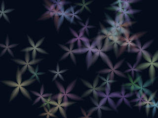
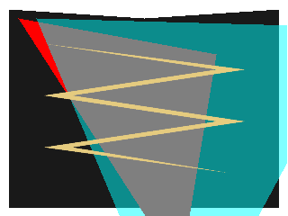

<h3> pichulia 가 가끔 그림이 필요할 때마다 만들던 코드를 그냥 git 에 올린 toy project 입니다. </h3>

픽셀좌표는 x,y 좌표로 표현하면 왼쪽위가 (0,0)이고 오른쪽으로 (1,0) 아래로 (0,1) 입니다.
실제 색상데이터는 (y * width + x) * 4 + ~~~ 에 저장되있음에 유의해야합니다.
변수 중 i, j를 사용하는 함수도 있는데, i는 y좌표, j는 x좌표입니다.

기본적으로 Image class 에 있는 픽셀 데이터는 마음껏 접근/수정할 수 있습니다.

 - if(img.data[0] == 255)img.data[3] = 127; 

Image class 를 이용해 간단한 도형을 그릴 수 있습니다.

 - img.draw_line(~~);
 - img.draw_circle(~~);

도형을 그릴 때 도움을 줄 Painter 유틸리티도 존재합니다.

 - painter.Draw(img, Triangle(~~), Color(~~));

그리고 여러분들이 구현해주시면 좋은 기능들도 많이 존재합니다. ^-^

사용 가능한 기능:

* 사각형 그리기 (O(wh))
* 원 그리기 (O(r^2))
* 다이아몬드 그리기 (O(r^2))
* 직선 그리기 (O(이미지 전체))
* 삼각형 그리기 (O(이미지 전체))
* 단순다각형 그리기 (O(n*이미지 전체))
* 다른 이미지 그리기 (O(max(w1h1, w2h2)))

예제 이미지

<table>
  <tr><td>

</td><td>

</td></tr>
  <tr><td>
Sample 1 : Red gradient                              
</td><td>
Sample 2 : Rectangles + Diamond + Circle             
</td></tr>
  <tr><td>

</td><td>

</td></tr>
  <tr><td>
Sample 3 : Rectangles + Diamond + Circle only border 
</td><td>
Sample 4 : Lines                                     
</td></tr>
  <tr><td>

</td><td>

</td></tr>
  <tr><td>
Sample 5 : Alpha blending and Alpha Behavior         
</td><td>
Sample 6 : Load Image                                
</td></tr>
  <tr><td>

</td><td>

</td></tr>
  <tr><td>
Sample 7 : Whatever you want                         
</td><td>
Sample 9 : Triangle and Polygon                      
</td></tr>
  <tr><td colspan=2>
                                                                          
</td></tr>
  <tr><td colspan=2>
Sample 8 : Resize Image                                                                                                        
</td></tr>
  <tr><td colspan=2>
                                                                        
</td></tr>
  <tr><td colspan=2>
Sample 10 : NUI Infographics                                                                                                   
</td></tr>
</table>

이미지 입/출력 레퍼런스 : https://github.com/nothings/stb

Inital Commit : 2020-03-16 pichulia

Publish github : 2021-06-08 pichulia
